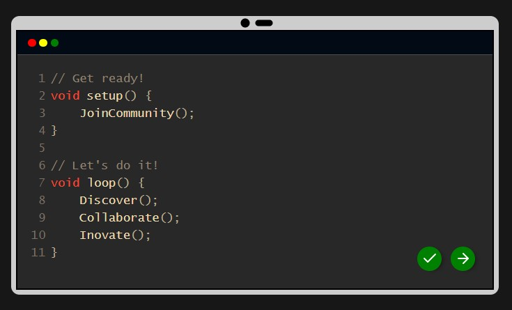

## NeoChip landing page code editor widget
The widget is built with the help of the [CodeMirror@6.65.7](https://www.codemirror.net) JavaScript library 

### Usage
To use this widget in any of your websites follow these steps:
1. **Prerequisites:** Make sure to have git installed.
2. **Clone the repo:** Clone the widget files into your local machine.
```
$ git clone https://github.com/neochipclub/neochip-editor.git
```
3. **Copy files:** Copy the `nc-editor.css` and `nc-editor.js` files to your project directory.
4. **Include files:** In your `index.html` file include the `nc-editor.css` and `nc-editor.js` files.
    ```
    <link rel="stylesheet" href="path/to/nc-editor.css">
    ```
    ```
    <script defer type="module" src="path/to/nc-editor.js"></script>
    ```
    **note** The JavaScript script must have the `type=module` attribute. 

5. **Include the widget:** Copy the `<div id="nc-editor">...</div>` to where you want the widget to be displayed.

### Customization
You can change the content of the code prompt by changing the value of the `content` variable in the `nc-editor.js` file.
### Contribute
We welcome contributions from everyone! Here's how you can get involved:
1. Fork the repository to your GitHub account.
2. Create a new branch for your feature or bug fix:
```
$ git checkout -b feature-name
```
3. Make your changes and commit them:
```
$ git add .
$ git commit -m "Description of your changes"
```
4. Push your changes to your fork:
```
$ git push origin feature-name
```
5. Open a pull request on GitHub.
### Contact
If you have any questions or need assistance, feel free to reach out to us on our [Instagram account](https://www.instagram.com/neochipclub) or open an issue in the repository.